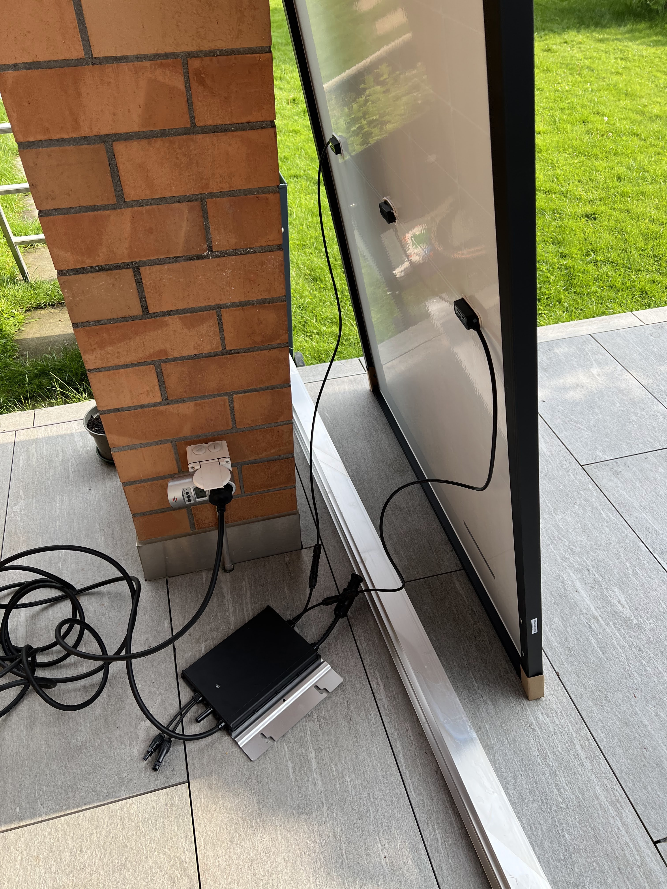

## Einführung

Unter Balkonkraftwerk versteht man eine Mini-Solaranlage (Photovoltaikanlage), welche typischerweise aus wenigen Panels, einem Wechselrichter sowie einem Anschlusskabel für die Steckdose besteht.

In der Schweiz (das meiste gilt auch für DE und AT) ist es erlaubt, ein Balkonkraftwerk bis 600W Ausgangsleistung (AC/Wechselstrom) ohne Elektriker oder Bewilligungen in Betrieb zu nehmen, d.h. in die Steckdose einstecken (plug&play!). Das einzige administrative, was man tun muss, ist eine Meldung ans Elektrizitätswerk.

## Beispielkomponenten

| Zubehör                                                                | Preis CHF 07/23   |
| ---------------------------------------------------------------------- | ----------------- |
| 2x Solarpanel 405W z.B. JA Solar, Suntech, etc. (1722x1134x30mm, 21kg) | ca. 320.-         |
| Wechselrichter Hoymiles HM-600 (z.B. von brack.ch)                     | ca. 180.-         |
| Anschlusskabel 5m mit T13/Schuko (z.B. von brack.ch)                   | ca. 45.-          |
| Verschlusskappe BC01 Male (z.B. von brack.ch)                          | ca. 5.-           |
| Messung optional z.B myStrom Wifi Switch (z.B. von swisscom.ch)        | ca. 40.-          |
| Befestigungsmaterial - je nach Installationsort (z.B. von AliExpress)  | ca. 15 - 100.-    |
| **Total**                                                              | **565.- bis 690.-** | 

Panels gibt es fast nur über B2B Kanäle zu kaufen. Im Set sind Balkonsolaranlagen meistens teurer. Ich habe deshalb auch schon Sammelbestellungen organisiert:



 

Die total 810W Gleichstromleistung (DC) sind mehr als der maximale Output von 600W. Liefert die Sonne mehr als 600W, riegelt der Wechselrichter ab, was auf der Grafik schön sichtbar ist.

## Ertrag und Amortisation

Bei Aufständerung gegen Süden kann mit einer jährlichen Energiemenge von 600kWh gerechnet werden. Bei horizontal an einem Geländer montierten Modulen mit Südausrichtung ca. 400kWh. Je schlechter der Winkel, desto weniger Ertrag. Sehr negativ auf den Ertrag wirkt sich auch Schatten aus. Ein teil-verschattetes Panel erzeugt z.B. weniger Ertrag wie das gleiche Panel bei Nebel!

Auf der Grafik sieht man Erträge von einer gegen Süden aufgeständerten Anlage mit etwas Beschattung in den Morgenstunden (siehe auch Grafik Leistungsbegrenzung). Durchschnittlicher Ertrag Juni/Juli war 3.8kWh pro Tag.

Je nach Eigenverbrauchsanteil und Einspeisevergütung berechnet sich der Jahresertrag. Bei einem angenommenen, mittleren Ertrag von 20Rp pro kWh und 600kWh Ertrag ergäbe sich ein Ertrag von CHF 180.-/Jahr.

Bei Kosten von CHF 600.- würde sich die Anlage innert 3.3 Jahren amortisieren!

Kommentare, Fragen und Anmerkungen zum Post gerne auf Twitter (oder bald X...) in folgendem Thread:



 

