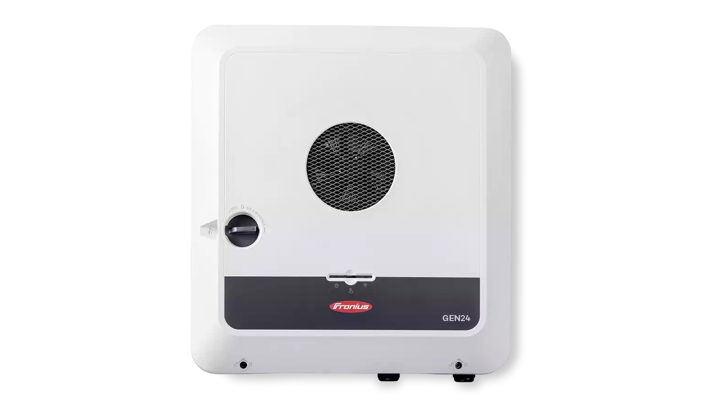
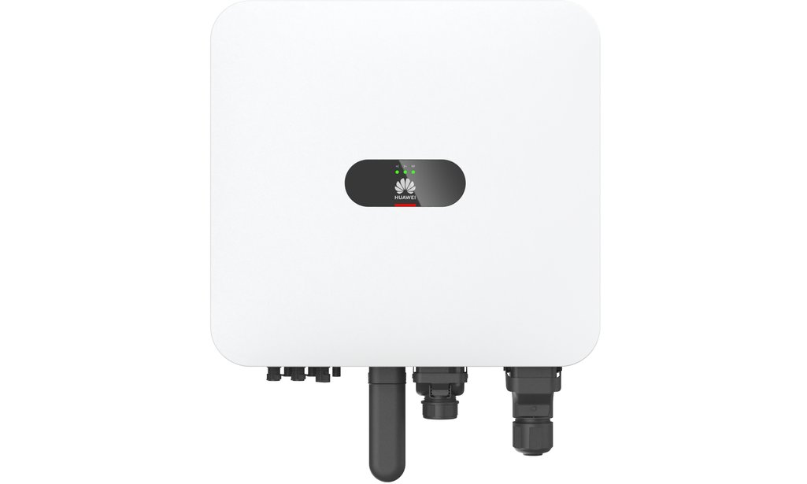

Die Anforderungen an moderne Photovoltaik-Systeme steigen: Notstromversorgung, PV-Nachladung im Blackout, Batteriespeicher und smarte Integration sind heute Standard. Zwei der spannendsten Systeme auf dem Markt sind der **Fronius Symo GEN24** und der **Huawei Sun2000 MAP0**. Doch wie schlagen sie sich im echten Leben – besonders, wenn man zusätzliche Wechselrichter oder Mikrowechselrichter einbinden will?

## Systemübersicht: Fronius vs. Huawei

### Fronius Symo GEN24 Plus

- Hybridwechselrichter (5–12 kW)
- 3-phasiger Notstrom (PV Point & Full Backup mit Enwitec)
- Dynamische Frequenzregelung (50–53 Hz)
- PV-Nachladung im Inselbetrieb
- Kompatibel mit BYD HVS/HVM, LG Flex, Fronius Reserva (verfügbar ab Mai 2025)
- Open source-freundlich (Modbus, API)
- Firmware-Updates über Solar.web (sehr einfach)

Produktseite: [Fronius Symo GEN24 Plus](https://www.fronius.com/de-ch/switzerland/solarenergie/installateure-partner/technische-daten/alle-produkte/wechselrichter/fronius-symo-gen24-plus/fronius-symo-gen24-12-0-plus-sc)

### Huawei SUN2000-5-12K-MAP0

- 3-phasiger Hybridwechselrichter mit integriertem Backup
- Feste Frequenz: 50 Hz im Inselbetrieb
- Kompatibel mit Huawei LUNA2000-S1 Speicher
- Mehrere MAP0 im Backupbetrieb möglich (seit SmartGuard 63A T0)
- Extrem schnelle Umschaltung (<20 ms)
- Updates über FusionSolar-App (nur mit Installateurszugang)

[Huawei SUN2000-12K-MAP0 Wechselrichter](https://solar.huawei.com/ch/professionals/all-products/SUN2000-5-12K-MAP0/specs)

## Inselbetrieb im direkten Vergleich

| Merkmal                          | **Fronius Symo GEN24 Plus**          | **Huawei Sun2000 MAP0**       |
| -------------------------------- | ------------------------------------ | ----------------------------- |
| Frequenzregelung im Inselbetrieb | Dynamisch (50–53 Hz)                 | Fixe 50 Hz                    |
| Backup-Umschaltzeit              | ca. 7–12 s                           | <20 ms                        |
| PV-Nachladung bei Blackout       | Ja                                   | Ja                            |
| Mehrere WR im Inselbetrieb       | Ja (nur Fronius oder synchronisiert) | Ja (seit 2024 mit SmartGuard) |
| Notstrom Versorgung              | 3phasig                              | 3phasig                       |
| Integration & Schnittstellen     | Offen (Modbus TCP, REST API)         | Eingeschränkt, Modbus TCP     |
| Firmware-Update                  | Per Solar.web                        | Installateur-Zugang notwendig |

## Beispielkonfiguration im direkten Vergleich

| Merkmal                                   | **Fronius Symo GEN24 Plus**                 | **Huawei Sun2000 MAP0**          |
|-------------------------------------------|---------------------------------------------|----------------------------------|
| **WR 1**                                  |                                             |                                  |
| Wechselrichter                            | Fronius Symo GEN24 12.0 SC Plus             | Huawei Sun2000-12k-MAP0          |
| Max. DC Leistung                          | 18 kWp (MPPT1: 14 kWp/ MPPT2: 9 kWp)        | 22 kWp                           |
| Max. Eingangsstrom pro MPPT               | MPPT1: 28 A, MPPT2: 14 A (Isc: 40 A / 20 A) | 16 A (Isc: 22 A)                 |
| MPP-Spannungsbereich                      | 80 - 800 V (max. 1'000 V)                   | 160 - 1'000 V (max. 1'100 V)     |
| Anzahl MPP-Tracker / Eingänge             | 2 / 3                                       | 2 / 2                            |
| AC Leistung                               | 12 kW                                       | 12 kW                            |
| **WR 2**                                  |                                             |                                  |
| Zusatzwechselrichter                      | Fronius Symo GEN24 5.0                      | Huawei Sun2000-5k-MAP0           |
| Max. DC Leistung                          | 7.5 kWp (MPPT1: 6.5 kWp/ MPPT2: 6.5 kWp)    | 9 kWp                            |
| Max. Eingangsstrom pro MPPT               | 12.5 A  (Isc: 20 A)                         | 16 A  (Isc: 22 A)                |
| MPP-Spannungsbereich                      | 80 - 800V (max. 1'000 V)                    | 160 - 1'000 V (max. 1'100 V)     |
| Anzahl MPP-Tracker / Eingänge             | 2 / 3                                       | 2 / 2                            |
| AC Leistung                               | 5 kW                                        | 5 kW                             |
| **Speicher**                              |                                             |                                  |
| Speicher                                  | BYD B-BOX Premium HVM 22.1 (22.08 kWh)      | Huawei LUNA2000-21-S1 (20.7 kWh) |
| Max. Lade- und Entladeleistung            | 20.5 kW (begrenzt durch WR 11.68 kW)        | 10.5 kW                          |
| Abmessungen                               | 2160 x 585 x 298 mm                         | 1230 x 590 x 255 mm              |
| Gewicht                                   | 319 kg                                      | 216 kg                           |
| IP                                        | IP55                                        | IP66                             |
| **Zubehör / Netzumschaltbox**             |                                             |                                  |
| Netzumschaltbox                           | Battery Backup Box AP 63A                   | Huawei Smartguard-63A-T0         |
| Internetverbindung                        | integriert                                  | Huawei SDongleA-05               |
| **Kosten in CHF (April 2025) inkl. MWST** | **CHF 13'110.-**                            | **CHF 12'400.-**                 |

## Was passiert bei "verbotenen Kombinationen"?

### Fronius Symo GEN24 Plus + Huawei SUN2000

- Huawei erkennt Fronius Inselnetz (zunächst 50 Hz) → funktioniert **kurzzeitig**
- Fronius erhöht Frequenz bei voller Batterie → Huawei regelt ab oder schaltet ab (>51,5 Hz)
- Inselnetz bleibt **stabil**

### Huawei Sun2000 MAP0 + Fronius Symo GEN24

- Fronius speist ins MAP-Inselnetz ein → MAP erkennt unerlaubte Einspeisung → **Inselbetrieb fällt aus**
- **Nicht erlaubt und instabil**

### Fronius Symo GEN24 Plus + Hoymiles HMS oder HM

- Hoymiles erkennt Frequenzabweichung → schaltet automatisch ab
- Kein Risiko für das Fronius-Inselnetz
- **Technisch unbedenklich**

## Firmware macht den Unterschied

- **Fronius:**
  - Alte Firmware (fro34310.upd) → WR wie Symo schalten bei >51,5 Hz ab
  - Neue Firmware (fro36120.upd) → WR erkennen Inselnetz und reduzieren Einspeisung

- **Huawei MAP:**
  - Frequenz bleibt fix bei 50 Hz
  - Ab 2024: Mehrere MAP0 über SmartGuard im Inselbetrieb unterstützt

## Fazit: Flexibel vs. Integriert

| Anforderung                          | Besseres System         |
|--------------------------------------|-------------------------|
| Mehrere WR im System                 | **Fronius Symo GEN24**  |
| Einfache Updates & Monitoring        | **Fronius Symo GEN24**  |
| USV-Style Umschaltung bei Blackout   | **Huawei Sun2000 MAP0** |
| Integration von Mikrowechselrichtern | **Fronius Symo GEN24**  |
| Sauberes, geschlossenes Systemdesign | **Huawei Sun2000 MAP0** |
| Günstiger Preis                      | **Huawei Sun2000 MAP0** |
| Tiefer Geräuschpegel                 | **Huawei Sun2000 MAP0** |
| Platzbedarf                          | **Huawei Sun2000 MAP0** |
| Staub & Wasserschutz                 | **Huawei Sun2000 MAP0** |

---

**Hast du Fragen oder willst deine PV-Anlage für Notstrom optimieren? Schreib mir gerne!**

