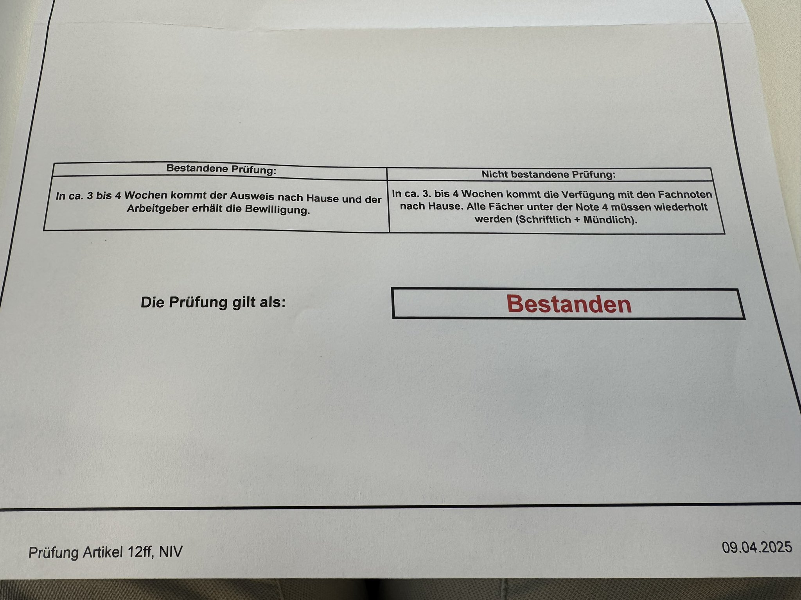
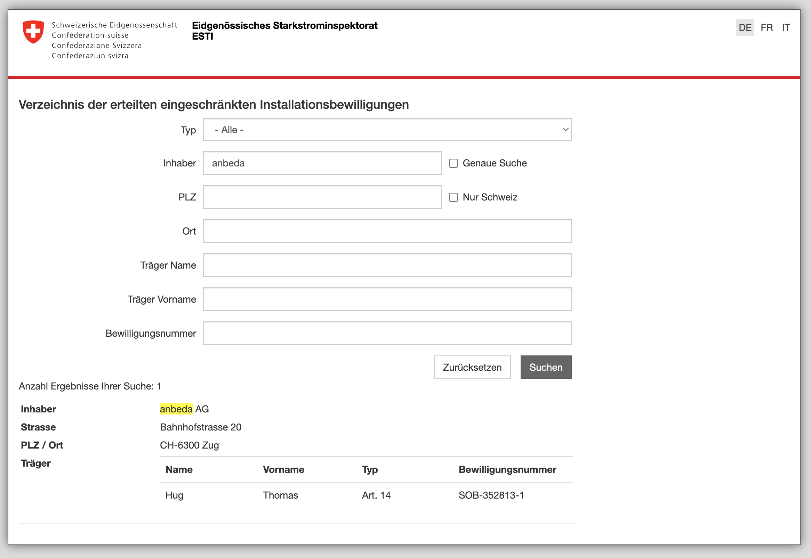

## Die eigene Photovoltaikanlage

Anfangs 2022 überzeugte mich unser Nachbar, doch auch gleich eine PV Anlage bauen zu lassen. Dies, nachdem wir schon 7 Jahre ein Haus besassen, es allerdings aus Sicht PV nicht über eine Standardofferte von IKEA geschafft haben, welche in der Schublade landete. Obwohl mein Vater auch schon eine PV Anlage hatte, ist der Funke nicht gesprungen. Auch die riesige Exceltabelle mit Anbietervergleichen vom Nachbar haben mich noch nicht mit dem Virus infiziert. Erst als einer der Anbieter vorbeigekommen ist, ist der Funke im Gespräch mit ihm gesprungen, während er mit seiner Drohne mein Dach fotografiert hat für eine Visualisierung. Von diesem Zeitpunkt an ging es plötzlich vorwärts!

Die Bestellung erfolgte am 01.04.2022: 18.8 kWp, 47 bifaziale 400W Module vom Schweizer Anbieter Megasol (produziert in China...), Fronius Symo Gen24 Plus 10.0 mit Notstrom (via Enwitec Box) sowie ein Symo 8.3 und eine BYD HVM 19.32 kWh Batterie. Das war das Nonplusultra – allerdings auch entsprechend teuer. Eigentlich bin ich normalerweise sparsamer unterwegs aber wenn dann plötzlich die Frau noch Feuer fängt und sagt 'wenn schon, denn schon', ist es geschehen!

## Die Installation

Frühling 2022 war vermutlich der ungünstigste Zeitpunkt um eine PV Anlage zu bestellen, denn damals brachen die Lieferketten zusammen und der Solarbauer konnte die versprochene Realisierung innert 8 Wochen nicht einhalten. Baustart erfolgte erst im September 2022, der erste Wechselrichter war im Oktober online und der zweite, den wir schlussendlich selber via Tutti besorgt haben im November. Für die Installation der Batterie und danach noch die Abschlusskontrolle musste ich mich sogar bis am 25. Januar 2023 gedulden!

## Die Zusammenarbeit

Die in die Länge gezogene Bauzeit hatte den Vorteil, dass ich näher am Bau dabei sein konnte und mich sogar eingemischt habe, als ich selber einen Wechselrichter besorgt habe, da der Distributor vom Solarteur nicht liefern konnte, resp. Ende Oktober 2022 der Liefertermin ab Mai 2023 in Aussicht gestellt wurde.

Mein Fazit war, dass der Solarteur nichts von AC (AC = Wechselstrom) verstand, der Elektriker nichts von DC (DC = Gleichstrom) und Dächern wissen wollte und beide keine Ahnung von IT hatten. Aus IT Sicht ist ein Wechselrichter ein weiteres Gerät im Heimnetzwerk mit einer IP Adresse und entweder einem RESTful API über http oder etwas altertümlicher Modbus TCP. Möchte man Geräte mit Modubus RTU auslesen wie z.B. Zähler, ist man mit einem Raspberry Pi und einem CHF 1.- günstigen USB Adapter auch schon dabei. Natürlich spielten mir 25 Jahre Erfahrung im Betrieb von IT Systemen bei meiner Firma [Nine](https://nine.ch) mit Linux in die Hände.

## Monitoring

Durch meinen IT Hintergrund habe ich mich also erstmals auf das Monitoring der Anlage fokussiert.

Nach Dutzenden von Stunden und Iterationen sieht mein Dashboard inzwischen etwas hübscher aus! Mehr Infos und Bauanleitungen dazu findet ihr in meinem [GitHub](https://github.com/thomhug/pv/) Repo.

## Händlerzugang

Irgendwann war alles gemonitort was man monitoren konnte und ich wollte mehr Panels. Nur war das Problem, dass es damals in der Schweiz Plug & Play Balkonsolaranlagen ab CHF 1'200.- zu kaufen gab, welche in Deutschland nur EUR 500 gekostet haben. Das kann doch nicht sein, dachte ich mir und fing an zu recherchieren. Relativ schnell wurde mir klar, dass der einzige Weg über die Distributoren laufen muss. Aber damals immer noch im Solar-Hype konnte man nicht einfach mit einer Firma einen Händlerzugang beantragen, nein, es musste eine Solarfirma sein! Nun, während einer kurzen Auszeit bei meiner Firma [Nine Internet Solutions AG](https://nine.ch) hatte ich 2017 die [anbeda AG](https://anbeda.ch) in Zug gegründet und unter anderem eine Buchhaltungssoftware programmiert, die niemand kaufen wollte. Nun gut, also weg mit dem Buchhaltungszeug und her musste eine Solar-Beratungs-Webseite! Wunderbar, nur wenige Tage später hatte ich meine Händlerzugänge bei Krannich Solar, Solarmarkt sowie Otto Fischer. Teilweise wurde ich aber zuerst abgewiesen und musste dann regelrecht betteln und auf meinen Elektroingenieur ETH Abschluss hinweisen!

Von da an war es passiert: Die ersten Recherchen im Onlineshop fühlten sich an wie ein Aufenthalt im Schlaraffenland! Alles war EXTREM BILLIG!!! Unglaublich. 35-50% hatte mein Solarbauer auf die Produkte draufgeschlagen. Das hat mich ziemlich getriggert und ich wollte nicht, dass andere auch zu viel bezahlten für ihre Solaranlagen.

Die ersten Panels haben wir noch selber bei Krannich abgeholt - was relativ mühsam war. Damit habe ich erste Balkonsolaranlagen zusammengebaut, was auch der erste [Beitrag](/posts/wie-funktioniert-ein-balkonkraftwerk/) von diesem Blog war! 

Später habe ich meinen Nachbar überzeugt, mit mir zusammen auf seinem Flachdach eine PV Anlage im Selbstbau zu realisieren. Das [ganze Projekt](/posts/erstes-pv-selbstbau-projekt/) habe ich in einem separaten Beitrag beschrieben.

# Weitere Anlagen

Nach dem Bau von weiteren Anlagen in der Familie habe ich meine Erfahrungen in einer [Schritt für Schritt Anleitung](/posts/pv-selbstbau-schritt-fuer-schritt/) für den Selbstbau niedergeschrieben. Mit wachsender Erfahrung stellte sich natürlich auch die Frage: Was darf man beim PV-Selbstbau eigentlich selbst machen – und wo braucht es Profis? 

Es zeigte sich, dass es nur wenige Elektriker gibt, welche gewillt sind, Privatpersonen im Selbstbau zu unterstützen. Wenn man für den DC Teil noch zusätzlich einen Solarteur benötigt, wird das nicht nur teuer, sondern solche Leute sind noch schwieriger zum organisieren. Meistens kümmern diese sich lieber um ihre eigenen Anlagen, bei denen sie mehr Marge generieren können.

## Was darf man im Selbstbau selber machen und wo braucht es eine fachkundige Person?

 (Quelle: ESTI Weisung 220)

Ohne Bewilligung darf man Unterkonstruktionen montieren, Module montieren und Module zusammenstecken. Für alles andere braucht es Fachpersonen mit Bewilligungen. Der Solarteur, resp. eine fachkundige Person mit eingeschränkten Installationsbewilliungen vom Eidgenössischen Starkstrominspektorat ESTI nach Niederspannungsinstallationsverordnung (NIV) Art. 14, darf alles ab AC Anlagenschalter machen.

Leider kann man nicht einfach eine Prüfung ablegen, sondern man muss entweder 3 Jahre Berufserfahrung nachweisen oder einen vom ESTI akkreditierten Kurs besuchen, welcher im Fall der Schweizerisch technischen Fachschule Winterthur (STFW) 19 Tage(!) dauert. Für Elektroingenieure ETH gibt es keine Ausnahmen.

Nach langem Hin und Her habe ich mich durchgerungen, mein Arbeitspensum für zwei Quartale auf 80% zu reduzieren damit ich den Kurs besuchen kann!

## Der Kurs an der STFW

Der Kurs besteht aus total 19 Tagen, hauptsächlich aus Theorie und Übungen. Während den vier praktischen Tagen galt es einerseits, den Tages-Kurs Persönliche Schutzausrüstung gegen Absturz (PSAgA) zu absolvieren sowie an drei Tagen verschiedene Montagesysteme an einem Dach-Modell zu montieren inkl. der nötigen Verkabelung und Messungen.

  

Um den Umgang mit Messungen zu üben gibt es Modelle, mit welchen man diverse Fehler simulieren kann.

Natürlich wollte ich auch sehen was passiert bei einer fehlerhaften Solarleitung, resp. wenn diese mit dem Potentialausgleich verbunden wird. Das wäre der Fall wenn ein Kabel gequetscht würde und mit der Unterkonstruktion in Kontakt käme. Dazu habe ich ein [Video](https://www.youtube.com/shorts/tfg6ObPm1RY) erstellt.

 

Kursinhalt der STFW - wichtig für die ESTI Prüfung sind nur die Module 1 + 2.

Die 19 Tage Schule muss man mit einer zweistündigen Zertifikatsprüfung abschliessen.

Die Prüfung besteht aus einem schriftlichen, einem mündlichen und einem praktischen Teil (messen).

Folgende Messgeräte habe ich mir angeschafft:

- PV DC Messgerät PV1-1+ von Benning, CHF 1'600.-
- Amperezange CC3 von Benning, CHF 160.-
- AC Installationstester IT 105 von Benning, CHF 780.-
- Spannungsprüfer Duspol analog von Benning, CHF 60.-

Total Messgeräte: CHF 2'600.-

## Kostenübersicht Kurse & Prüfungen

Wenn wir gerade bei Ausgaben sind:

- Kurskosten STFW, CHF 5'150.-
- STFW Prüfungsgebühr, CHF 250.-
- Prüfung NIV14 beim ESTI CHF 1'230.-
- Gebühr Ausstellen Bewilligung ESTI, CHF 460.-

Total Kurse & Prüfungen: CHF 7'090.-

(Quelle: [https://verzeichnisse.esti.ch/de/niv12-res.htm](https://verzeichnisse.esti.ch/de/niv12-res.htm))

## Fazit

Heute bin ich stolz, offiziell Projekte eigenständig umsetzen zu dürfen – und freue mich schon auf viele weitere Solarprojekte! Meldet euch bei mir, falls ihr Hilfe benötigt beim Selbstbau! Hier geht es zu meinem [Angebot](/angebot/)!
