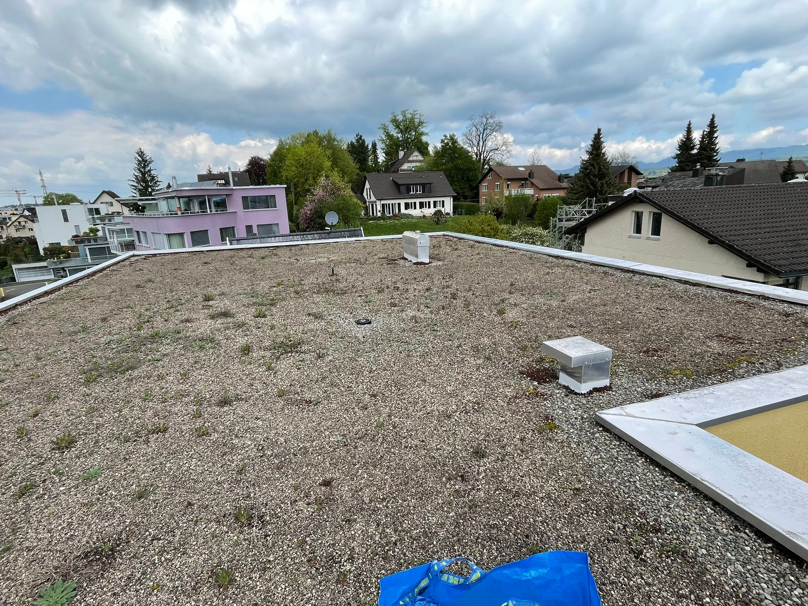

## Übersicht

Im folgenden Artikel beschreibe ich den chronologischen Ablauf von meinem ersten PV Selbstbau Projekt, welches ich zusammen mit einem Nachbar auf seinem Dach realisiert habe. Am Schluss findet ihr eine Materialliste sowie die Kosten.

## Überzeugungsarbeit

Als ich den Bau einer 18.8kWp Anlage mit 19.32kWh Batterie auf unserem Haus verfolgen durfte - ich wusste gar nicht, dass es sowas wie Selbstbau gibt, resp. ich kam gar nicht auf die Idee, daran zu denken. Das Thema Photovoltaik war in meinem Kopf seit wir das Haus im Jahr 2015 gekauft hatten. Viel mehr als eine IKEA 0815 Offerte und ein möglicher Modulplan von einem Kollegen ist aber nicht passiert. Das Thema war mir zu unklar um vorwärts zu machen. Erst anfangs 2022, als ein anderer Nachbar x Offerten reingeholt hat, sah ich die Chance, auch gleich mitzumachen. Klick gemacht hat es dann, als der erste Anbieter bei uns war und mit der Drohne Fotos gemacht hat. Ab dann wollte ich es unbedingt! :)
Sobald unsere Anlage lief (ab Oktober 2022 - wegen Lieferschwierigkeiten), hats mich mit dem Visualisierungs-Virus gepackt und natürlich hat nicht nur der andere Nachbar ebenfalls ein Raspberry Pi im Haus und liefert seine Daten auf meinen Cloudserver, sondern der eine Nachbar wurde so quasi Opfer meiner Passion und musste sich immer meine Stories anhören. So wirklich begeistern konnte ich ihn allerdings nicht.

Plötzlich hats dann aber doch noch geklickt! Ich denke die Q1 Stromrechnung war nicht ganz unschuldig!

## Es geht los! Erste Schritte

Ende April 2023 war der Nachbar auf dem Dach und in ihm ist die Überzeugung gereift, dass er auch eine PV Anlage wollte und zwar wollte er sie nicht einfach bauen lassen, sondern mit mir zusammen realisieren! Hier hat die Info geholfen, dass man Flachdachanlagen nicht anschrauben, sondern nur beschweren muss. Ich würde nicht selber ein Loch in mein Dach bohren wollen. Niemand will ein undichtes Dach! :)

Kurz darauf hat er mir einen Dachplan geschickt.

## Planung startet

Also fing ich an, mit Onlinetools zu experimentieren. 

Anfangs sah das noch nicht so toll aus. Ich habe mich in PV Selbstbau eingelesen in Ratgeber und Foren. Schnell war klar, dass ich ohne B2B Zugang bei einem Solar Distributor nicht an günstige Panels und Komponenten kommen werde. Also habe ich mich bei Solarmarkt, Krannich, Otto Fischer und Elektro Material als Kunde beworben! Fast unvorstellbar, dass ich teilweise erst abgelehnt wurde und richtig betteln musste um Kunde zu werden!? Am 2.5. hats dann doch geklappt.

Dank den Zugängen zu den B2B Shops habe ich endlich gesehen, was die Komponenten wirklich kosten und war geschockt! Mein Solarbauer hat nämlich bei uns einfach mal 35-50% auf die Preise draufgehauen! Ich habe mich gefühlt wie im Schlaraffenland! Ein grosser Schub um das Projekt weiter zu treiben!

Zwei Tage später bin ich dann bei K2 Base gelandet und die Pläne sahen schon besser aus!

Meine ersten Berechnungen haben ergeben, dass uns die Anlage etwa CHF 12-15'000 kosten würde, was etwa 1/3 von dem war, was ich selber bei unserem Dach bezahlt hatte ...

Parallel dazu hat der Nachbar und Hauseigentümer Vergleichsofferten eingeholt. Wegen der immer noch angespannten Situation und den vielen Anfragen haben 2/3 der angefragten Firmen gar keine Offerten abgegeben. Das Resultat war von Firma 1 eine Offerte über CHF 50’321.69 für eine 18.26kWp SolarEdge Anlage mit 44x415W Trina Modulen sowie eine Offerte von Firma 1 für CHF 38'825.00 für eine 17kWp Huawei Anlage mit 42x405W JA Solar Panels. Meine 1/3 Theorie war nicht so falsch. Das hat natürlich auch geholfen, dass der Nachbar bereit war, Versuchskanninchen zu spielen :-)

## Testbestellung

Am 6.5. haben wir bei Krannich Panels von zwei verschiedenen Herstellern bestellt sowie minimale Komponenten von K2 D-Dome Classic. Ich wusste inzwischen, dass man unkompliziert [Balkonsolar](/posts/wie-funktioniert-ein-balkonkraftwerk/) Anlagen mit 600W ans Netz hängen kann, somit war auch schon klar war was mit den Panels passieren würde. Leider war wegen überlasteter Logistik der frühste Abholtermin erst am 23.5.!

## Testsystem aufgebaut

Als wir dann endlich die Bestellung abholen konnten, habe ich noch am selben Abend zwei Panels auf das K2 geschraubt. Profis werden sehen, dass es falsch rum ist, denn wer liest schon Manuals? ;-)

Ich war begeistert wie einfach das geklickt und geschraubt werden kann! Die Ingenieure von K2 Systems haben da sehr gute Arbeit geleistet! Echt cool & danke!

## Bestellung

Bevor wir definitiv bestellen konnten, musste mit der Gemeinde noch geklärt werden, welche Panels erlaubt waren. Für das vereinfachte Verfahren waren nämlich full black Module vorgesehen aber die gewünschten Trina Solar TSM-430NEG9R.28 Vertex S+ Doppelglas waren nicht voll schwarz - so wie die Testmodule für Balkonsolar, welche nur 405W waren. Der Nachbar wollte unbedingt das Maximum herausholen, also mussten 430W Module her. Zum Glück wurden die Trina Module dann am 1.6. von der Gemeinde akzeptiert und somit habe ich am Abend sofort für knapp CHF 11'000.- Material bestellt.

Sehr positiv überrascht war ich, als Otto Fischer den Wechselrichter am nächsten Tag schon vor dem Mittag geliefert hat! Die haben die Logistik im Griff!

Der Teil von Krannich wurde auf den 23.6. terminiert. Also wieder drei Wochen warten ...

## Bewilligungen

Die Bewilligung für die Gemeinde sowie der Antrag für die Subventionen (unsere Gemeinde bezahlt trotz Pronovo Bundessubventionen auch noch einen Beitrag!) hat der Nachbar übernommen, ich habe mich um das Teilnahme Anschluss Gesuch (TAG) vom EVU gekümmert.

Ebenfalls mussten wir noch einen Elektriker finden, welcher das ganze ans Netz anschliesst. 

Was noch fehlte, waren die Steine um die Konstruktion zu beschweren. Dankenderweise liefert K2 Base diese Infos auch! Fast eine Tonne Steine! Uff!

## Lieferung

Endlich kam die Lieferung am 23.6.!





Auch die Steinplatten hatte der Nachbar organisiert:





Noch ausstehend war allerdings die Bewilligung von der Gemeinde. Wir durften also nichts mahen auf dem Dach und wollten auch kein Risiko eingehen - insbesondere wenn man Behördenmitglieder als Nachbarn hat! :) Gegen die Montage vom Wechselrichter kann aber niemand etwas sagen, also hat er den schon mal montiert.

Diese frohe Botschaft musste ich natürlich auch teilen!





Dankenderweise kam dann auch noch die Bewilligung der Gemeinde und der weiteren Planung stand nichts mehr im Wege!





## Baustart

Am 30.6. kam bereits der Kran!





Und einen Tag später hatten wir schon 14/44 Modulen montiert!





// 1.7. (post 3.7.) optimizer




// 1.7. 28/44




// 3.7. 40/44




// 7.7. durchgestossen:




// 8.7. dach fertig:




// 17.7. fertig, einschalten verboten:




// 20.7. fertig:




## Learnings

- Ich würde erst bestellen wenn das EVU bestätigt hat, dass die benötigte Anschlussleistung verfügbar war. Bei diesem Projekt dachte ich, das wird schon klappen im Quartier. Das ist aber nicht unbedingt sicher wie sich bei meinem Schwager zeigte!

## Materialliste & Kosten

