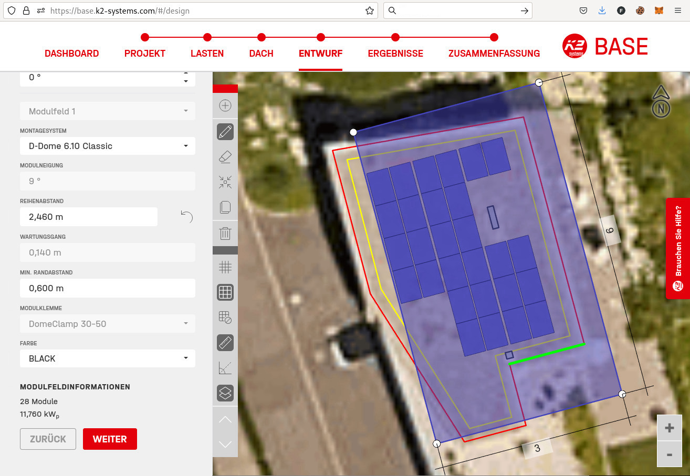

## Übersicht

Im folgenden Artikel beschreibe ich den chronologischen Ablauf von meinem ersten PV Selbstbau Projekt, welches ich zusammen mit einem Nachbar auf seinem Dach realisiert habe. Am Schluss findet ihr eine Materialliste sowie die Kosten und eine Schätzung der Amortisationsdauer.

## Überzeugungsarbeit

Als ich den Bau einer 18.8kWp Anlage mit 19.32kWh Batterie auf unserem Haus im September 2022 verfolgen durfte, wusste gar nicht, dass es sowas wie Selbstbau gibt, resp. ich kam gar nicht auf die Idee, daran zu denken. Das Thema Photovoltaik war bereits in meinem Kopf seit wir das Haus im Jahr 2015 gekauft hatten. Viel mehr als eine IKEA 0815 Offerte und ein möglicher Modulplan von einem Kollegen ist aber nicht passiert. Das Thema war mir zu unklar um vorwärts zu machen. Erst anfangs 2022, als ein anderer Nachbar x Offerten reingeholt hat, sah ich die Chance, auch gleich mitzumachen. Klick gemacht hat es dann, als der erste Anbieter bei uns war, mit seiner Drohne Fotos vom Dach gemacht hat und mir dann mit der Offerte eine Visualisierung zugestellt hatte. Ab dann wollte ich es unbedingt! :)

Sobald unsere Anlage lief (ab Oktober 2022 - wegen Lieferschwierigkeiten), hats mich mit dem Visualisierungs-Virus gepackt und natürlich hat nicht nur der andere Nachbar ebenfalls ein Raspberry Pi im Haus und liefert seine Daten auf meinen Cloudserver, sondern der eine Nachbar wurde so quasi Opfer meiner Passion und musste sich immer meine Stories anhören. So wirklich begeistern konnte ich ihn allerdings nicht.

Plötzlich hats dann aber doch noch geklickt! Ich denke die Q1 Stromrechnung war nicht ganz unschuldig!

## Es geht los! Erste Schritte

Ende April 2023 war der Nachbar auf dem Dach und in ihm ist die Überzeugung gereift, dass er auch eine PV Anlage haben wollte und zwar wollte er sie nicht einfach bauen lassen, sondern mit mir zusammen im Selbstbau realisieren! Hier hat sicher die Info geholfen, dass man Flachdachanlagen nicht anschrauben, sondern nur beschweren muss. Ich würde nicht selber ein Loch in mein Dach bohren wollen. Niemand will ein undichtes Dach! :)

Kurz darauf hat er mir einen Dachplan geschickt.

## Planung startet

Also fing ich an, mit Onlinetools zu experimentieren. 

Anfangs sah das noch nicht so toll aus. Ich habe mich in PV Selbstbau eingelesen in Ratgeber und Foren. Schnell war klar, dass ich ohne B2B Zugang bei einem Solar Distributor nicht an günstige Panels und Komponenten kommen werde. Also habe ich mich bei Solarmarkt, Krannich, Otto Fischer und Elektro Material als Kunde beworben! Fast unvorstellbar, dass ich teilweise erst abgelehnt wurde und richtig betteln musste um Kunde zu werden!? Am 2.5. hats dann doch geklappt.

Dank den Zugängen zu den B2B Shops habe ich endlich gesehen, was die Komponenten wirklich kosten und war geschockt! Mein Solarbauer hat nämlich bei uns einfach mal 35-50% auf die Preise draufgehauen! Dank den günstigen Einkaufspreisen habe ich mich gefühlt wie im Schlaraffenland! Ein grosser Schub um das Projekt weiter zu treiben!

Zwei Tage später bin ich dann bei K2 Base gelandet und die Pläne sahen schon besser aus!

Meine ersten Berechnungen haben ergeben, dass uns die Anlage etwa CHF 12-15'000 kosten würde, was etwa 1/3 von dem war, was ich selber bei unserem Dach bezahlt hatte ...

Parallel dazu hat der Nachbar und Hauseigentümer Vergleichsofferten eingeholt. Wegen der immer noch angespannten Situation und den vielen Anfragen haben 2/3 der angefragten Firmen gar keine Offerten abgegeben. Das Resultat war von Firma 1 eine Offerte über CHF 50’321.69 für eine 18.26kWp SolarEdge Anlage mit 44x415W Trina Modulen sowie eine Offerte von Firma 2 für CHF 38'825.00 für eine 17kWp Huawei Anlage mit 42x405W JA Solar Panels. Meine 1/3 Theorie war nicht so falsch. Das hat natürlich auch geholfen, dass der Nachbar bereit war, Versuchskanninchen zu spielen :-)

## Testbestellung

Am 6.5. haben wir bei Krannich Global Solar Distribution Panels von zwei verschiedenen Herstellern bestellt, sowie minimale Komponenten von K2 D-Dome Classic. Ich wusste inzwischen, dass man unkompliziert [Balkonsolar](/posts/wie-funktioniert-ein-balkonkraftwerk/) Anlagen mit 600W ans Netz hängen kann, somit war auch schon klar, was mit den Test-Panels passieren würde. Leider war wegen überlasteter Logistik der frühste Abholtermin erst am 23.5.!

## Testsystem aufgebaut

Als wir dann endlich die Bestellung abholen konnten, habe ich noch am selben Abend zwei Panels auf die K2 Systems Unterkonstruktion geschraubt. Profis werden sehen, dass es falsch rum ist, denn wer liest schon Manuals? ;-)

Ich war begeistert, wie einfach das geklickt und geschraubt werden kann! Die Ingenieure von K2 Systems haben da sehr gute Arbeit geleistet! Echt cool & danke!

## Bestellung

Bevor wir definitiv bestellen konnten, musste mit der Gemeinde noch geklärt werden, welche Panels erlaubt waren. Für das vereinfachte Verfahren waren nämlich full black Module vorgesehen aber die gewünschten Trina Solar TSM-430NEG9R.28 Vertex S+ Doppelglas waren nicht voll schwarz wie die Testmodule für Balkonsolar, welche nur aber nur 405W Leistung hatten. Der Nachbar wollte unbedingt das Maximum herausholen, also mussten 430W Module her. Zum Glück wurden die Trina Module dann am 1.6. von der Gemeinde akzeptiert und somit habe ich am Abend sofort für knapp CHF 11'000.- Material bestellt.

Sehr positiv überrascht war ich, als Otto Fischer den Wechselrichter am nächsten Tag schon vor dem Mittag geliefert hat! Die haben die Logistik im Griff!

Der Teil von Krannich wurde erst auf den 23.6. terminiert. Also wieder drei Wochen warten ...

## Bewilligungen

Der Bewilligungsantrag für die Gemeinde sowie der Antrag für die Subventionen (unsere Gemeinde bezahlt trotz Pronovo Bundessubventionen auch noch einen Beitrag!) hat der Nachbar übernommen, ich habe mich um das Teilnahme Anschluss Gesuch (TAG) vom EVU gekümmert.

Ebenfalls mussten wir noch einen Elektriker finden, welcher das ganze ans Netz anschliesst. 

Was noch fehlte, waren die Steine um die Konstruktion zu beschweren. Dankenderweise liefert K2 Base diese Infos auch! Fast eine Tonne Steine! Uff!

## Lieferung

Endlich kam die Lieferung am 23.6.!





Auch die Steinplatten hatte der Nachbar organisiert:





Noch ausstehend war allerdings die Bewilligung von der Gemeinde. Wir durften also nichts mahen auf dem Dach und wollten auch kein Risiko eingehen - insbesondere wenn man Behördenmitglieder als Nachbarn hat! :) Gegen die Montage vom Wechselrichter kann aber niemand etwas sagen, also hat er den schon mal montiert.

Diese frohe Botschaft musste ich natürlich auch teilen!





Dankenderweise kam dann auch noch die Bewilligung der Gemeinde und der weiteren Umsetzung stand nichts mehr im Wege!





## Bau

Am 30.6. kam bereits der Kran!





Und einen Tag später hatten wir schon 14/44 Module montiert.





Am zweiten Tag waren 28/44 Module montiert.





Am zweiten Tag haben wir noch gemerkt, dass wir die vier Optimizer rund um den kleinen Kamin vergessen hatten ...





Nach dem dritten Tag waren fast alle Module (40/44) montiert.





Alle Versuche, das bestehende Rohr vom Dach in die Garage zum Wechselrichter durchzustossen, sind gescheitert. Danke nochmals an die vielen Tipps auf Twitter! Erst der Elektriker hats dann mit seiner Profi-Saite im ersten Anlauf geschafft!





Somit konnten wir am 8.7. das Dach fertig machen! Leider hat sich der Elektriker entschieden, den DC Teil nicht zu machen. Da ich das nicht selber machen darf, mussten wir einen Solarbauer organisieren, welcher erst am 17.7. Zeit hatte, also nochmals warten ...





Am 17.7. hat alles mit dem DC Teil alles geklappt und wir konnten die Anlage erfolgreich testen. Da allerdings die Bewilligung der Installationsanzeige vom Elektriker vom EVU noch nicht eingetroffen ist, mussten wir die Anlage wieder ausschalten!





Erst am 20.7. war das letzte Dokument auch noch eingetroffen und wir durften endlich einschalten!





Ein super Gefühl, wenn man eine selber gebaute Anlage sieht, wie sie >15kW einspeist!

## Learnings

- Ich würde erst bestellen wenn das EVU bestätigt hat, dass die benötigte Anschlussleistung verfügbar war. Bei diesem Projekt dachte ich, das wird schon klappen im Quartier. Das ist aber nicht unbedingt sicher wie sich bei meinem Schwager zeigte!
- Solarkabel müssen geschlauft werden damit möglichst kein elektrisches Feld entsteht. Das bedeutet, statt Anfang und Ende eines Strings mit den Kabeln in den Keller zu verbinden, verläuft vom Ende vom String ein Kabel unter dem ganzen String durch zurück zum Anfang. Plus und Minus sind immer unter den Panels beieinander.
- Kupfer darf nicht direkt auf Alu kommen, sonst oxidiert es
- 50er Rohre kann man nicht mit einer dünnen Saite durchstossen
- MC4 Solarstecker müssen in der Luft sein und dürfen nicht am Boden liegen wegen Wasser!
- Kabel müssen vor Sonne geschützt werden. Mit UV beständigen Rohren schützen oder noch besser, noch langlebigere Alurohre verwenden. 
- Kabelrohre müssen fixiert werden - entweder mit Kabelbinder oder noch besser: eingraben.

## Materialliste & Kosten

Stand 6.8.2023 ist die folgende Liste noch nicht 100% komplett. Die Rechnung der DC-Abnahme sowie die Rechnung (und Durchführung) der Schlusskontrolle sind noch ausstehend. ZEV ist erst vorbereitet (werde darüber in einem separaten Artikel schreiben) und die Subventionen wurden noch nicht ausbezahlt. Ich werde den Artikel anpassen, sobald die finalen Werte vorhanden sind. Ich werde über Änderungen im Tweet ganz unten informieren.

|                                                           | Anzahl | Einzelpreis | Total exkl. MWST |
| --------------------------------------------------------- | ------ | ----------: | ---------------: |
| **Panels, Optimizer und Kabel**                           |        |             |                  |
| TSM-430NEG9R.28 Vertex S+                                 | 44     | 139.75      | 6'149.00         |
| Recyclinggebühr                                           | 44     | 0.87        | 38.28            |
| Huawei Smart PV Optimierer                                | 4      | 51.45       | 205.80           |
| Solarkabel rot/schwarz 100m                               | 3      | 127.87      | 383.60           |
| Flexrohr 32mm 50m                                         | 1      | 56.40       | 56.40            |
| MC4 Stecker Paare                                         | 30     | 3.10        | 93.00            |
| Verschraubung PA M32×1.5 hgu                              | 4      | 2.82        | 11.27            |
| Gegenmutter Plica PA M32×1.5                              | 4      | 0.68        | 2.70             |
| **Subtotal**                                              |        |             | **Fr. 6'940.05** |
|                                                           |        |             |                  |
| **Unterkonstruktion**                                     |        |             |                  |
| K2 BasicRail 4.40m                                        | 17     | 26.78       | 455.19           |
| K2 Dome 6.10 Peak                                         | 54     | 4.23        | 228.42           |
| K2 Dome 6.10 SD                                           | 54     | 1.81        | 97.74            |
| MC Set DomeClamp 30-50mm                                  | 80     | 2.05        | 163.60           |
| EC Set DomeClamp Black 30-50                              | 60     | 2.01        | 120.80           |
| SN M8 SS (SU=250)                                         | 1      | 177.50      | 177.50           |
| SC SC M8x20 HS (SER) (SU=200)                             | 1      | 58.00       | 58.00            |
| Cable Manager PA66W (SU=100)                              | 1      | 29.00       | 29.00            |
| SpeedPorter                                               | 30     | 1.90        | 57.00            |
| RC SR/P D/S- Dome /2.11 SET                               | 20     | 4.13        | 82.60            |
| Steinplatten 40x40x3.9 (14kg)                             | 39     | 2.60        | 101.39           |
| **Subtotal**                                              |        |             | **Fr. 1'571.24** |
|                                                           |        |             |                  |
| **Wechselrichter**                                        |        |             |                  |
| Huawei SUN2000-17KTL-M2 / 27A                             | 1      | 1'963.50    | 1'963.50         |
| Smart Dongle-Wlan-FE                                      | 1      | 49.75       | 49.75            |
| Smart Power Sensor DTSU666-H 100A/40mA (3ph)              | 1      | 130.20      | 130.20           |
| Installationskabel FE0 5×6mm² 10m                         | 1      | 36.40       | 36.40            |
| Kabelkanäle 2m                                            | 2      | 16.20       | 32.40            |
| Kabelkanal Flachwinkel                                    | 2      | 21.25       | 42.50            |
| Kabelkanal Endstücke                                      | 2      | 6.50        | 13.00            |
| **Subtotal**                                              |        |             | **Fr. 2'267.75** |
|                                                           |        |             |                  |
| **Erdung**                                                |        |             |                  |
| LPC MH SET                                                | 20     | 1.71        | 34.20            |
| T-Seil 16mm² gn-gb                                        | 30     | 4.53        | 135.90           |
| Kabelschuh 6mm/16mm                                       | 1      | 0.71        | 0.71             |
| AP-Potentialausgleichsschiene                             | 1      | 14.00       | 14.00            |
| Unterlagsscheibe BET M8/Ø25mm                             | 25     | 0.31        | 7.65             |
| Rohrkabelschuh Mischke 8mm/16mm                           | 25     | 0.71        | 17.75            |
| Fächerscheibe M8 8.4×15×0.8mm                             | 200    | 0.05        | 9.84             |
| **Subtotal**                                              |        |             | **Fr. 220.05**   |
|                                                           |        |             |                  |
| **Werkzeug**                                              |        |             |                  |
| Arbeitshandschuhe PLICA Gloves                            | 1      | 17.80       | 17.80            |
| Dome Speed Spacer large                                   | 2      | 35.15       | 70.30            |
| Crimp Zangen (Ferrule + MC4 + Abisolierer)                | 1      | 100.64      | 100.64           |
| Rohr Crimp Zange 6-50mm (Erdung)                          | 1      | 14.17       | 14.17            |
| Isolierband CELL 328                                      | 1      | 3.65        | 3.65             |
| Duct Tape 50mm                                            | 1      | 7.65        | 7.65             |
| **Subtotal**                                              |        |             | **Fr. 214.21**   |
|                                                           |        |             |                  |
| **Transportkosten**                                       |        |             |                  |
| Versand Krannich                                          | 1      | 330.83      | 330.83           |
| Frachtversicherung                                        | 1      | 8.21        | 8.21             |
| Komissionierung Krannich (Abholung)                       | 1      | 50.00       | 50.00            |
| Kran                                                      | 1      | 382.50      | 382.50           |
| **Subtotal**                                              |        |             | **Fr. 771.54**   |
|                                                           |        |             |                  |
| **Handwerker / Experten**                                 |        |             |                  |
| Elektriker (Anteil Solar)                                 | 1      | 1'851.85    | 1'851.85         |
| DC Abnahme (Schätzung)                                    | 1      | 1'177.25    | 1'177.25         |
| Schlusskontrolle (Schätzung)                              | 1      | 600.00      | 600.00           |
| **Subtotal**                                              |        |             | **Fr. 3'629.10** |
|                                                           |        |             |                  |
| **Balkonsolar Erweiterung**                               |        |             |                  |
| TSM-430NEG9R.28 Vertex S+                                 | 2      | 139.75      | 279.50           |
| Recyclinggebühr                                           | 2      | 0.87        | 1.74             |
| Windbreaker                                               | 2      | 15.95       | 31.90            |
| Hoymiles HM-800 Microwechselrichter                       | 1      | 212.63      | 212.63           |
| BC01 Verschlusskappe Male                                 | 1      | 5.52        | 5.52             |
| BC01 Buchse Female                                        | 1      | 5.99        | 5.99             |
| 3-adriges Kabel für Micro WR 2.5mm 30m                    | 1      | 30.90       | 30.90            |
| 3-adriges Kabel für Micro WR 2.5mm 7m flexibel            | 1      | 11.69       | 11.69            |
| AP-Abzweigdose                                            | 1      | 4.40        | 4.40             |
| Wago Klemme 3L                                            | 1      | 0.23        | 0.23             |
| **Subtotal**                                              |        |             | **Fr. 584.50**   |
|                                                           |        |             |                  |
| **Testmaterial / Falschbestellung / nicht verwendet**     |        |             |                  |
| Einziehdraht Nylon m.Feder                                | 1      | 40.90       | 40.90            |
| Mat S Support Pad (SU=50)                                 | 1      | 161.50      | 161.50           |
| K2 Dome Mat-S Tool                                        | 3      | 1.55        | 4.65             |
| PV-Steckverbinder Weidmüller                              | 4      | 8.10        | 32.40            |
| Smart Meter SDM630 Modbus Mid 100A                        | 1      | 119.78      | 119.78           |
| Kabelendhülsen Pack 16mm2                                 | 1      | 13.70       | 13.70            |
| 5-adriges Kabel 2.5mm2 10m                                | 1      | 15.70       | 15.70            |
| Sechskantmutter M8 Ø0.8mm DIN                             | 200    | 0.07        | 14.30            |
| **Subtotal**                                              |        |             | **Fr. 402.93**   |
|                                                           |        |             |                  |
| **Total**                                                 |        |             | **Fr. 16'601.37** |
| **Total Ausgaben inkl. MWST**                             |        |             | **Fr. 17'879.67** |
| **Total Ausgaben inkl. MWST pro kWp**                     | 19.78  |             | **Fr. 903.93** |
|                                                           |        |             |                  |
| **Subventionen**                                          |        |             |                  |
| Pronovo Bund (Provisorisch)                               | 1      |             | \-Fr. 7'912.00   |
| Gemeinde Kt. Zug (Provisorisch)                           | 1      |             | \-Fr. 3'956.00   |
| **Subtotal**                                              |        |             | **\-Fr. 11'868.00** |
|                                                           |        |             |                  |
| **Netto Investition inkl. MWST**                          |        |             | **Fr. 6'011.67** |
| **Netto Investition inkl. MWST pro kWp**                  | 19.78  |             | **Fr. 303.93**   |
|                                                           |        |             |                  |
| **Erweiterung ZEV (sep. Artikel folgt)**                  |        |             |                  |
| Smart Power Sensor DTSU666-H 100A/40mA (3ph)              | 1      | -130.20     | -130.20          |
| RS485 Modbus Adapter                                      | 1      | 8.12        | 8.12             |
| Smart Meter SDM630 Modbus Mid 100A                        | 5      | 119.78      | 598.90           |
| Smart Meter SDM630 Modbus Mid 100A MCT für Hauptzuleitung | 1      | 205.20      | 205.20           |
| Raspberry Pi 4G                                           | 1      | 135.38      | 135.38           |
| Netgear Switch 5 Port                                     | 1      | 25.40       | 25.40            |
| Elektriker (Anteil ZEV)                                   | 1      | 1007.00     | 1007.00          |
| **Subtotal**                                              |        |             | **Fr. 1'849.80** |
| **Subtotal inkl. MWST**                                   |        |             | **Fr. 1'992.23** |

## Amortisation

Die Anlage produziert eine Energiemenge von ca. 19'000 kWh pro Jahr. Davon können bei einem Verbrauch von ca. 8'000 kWh (eine Wohnung) ca. 3'200 kWh direkt verbraucht werden. Somit erhält der Eigentümer für die restlichen, eingespeisten 15'800 kWh bei einem Einspeisetarif von 18.9 RP jährlich eine Einspeisevergütung von CHF 2'984.39 und spart bei 3'200kWh Eigenverbrauch bei einem durchschnittlichen Tarif von 31.1 RP CHF 996.57. Die jährliche Amortisation der Anlage beträgt somit CHF 3'980.97 und die Anlage würde sich innerhalb von 1.51 Jahren (!) bereits amortisieren!

Sobald ZEV in Betrieb geht, kann der Besitzer seinem Mieter in der zweiten Wohnung sowie an Allgemeinstrom zusätzliche, rund 5'000kWh verkaufen. Der Verkauf erfolgt zu 80% vom normalen Einkaufspreis, also 24.9 RP. Statt der Einspeisung von 18.9 RP fliessen so zusätzliche 6 RP pro kWh in die Kasse des Eigentümers, was jährlich CHF 301.29 entspricht. Die ZEV Erweiterung amortisiert sich so in 6.61 Jahren.

Coole Sache, oder?

Kommentare, Fragen und Anmerkungen zum Post gerne auf X (ex-Twitter) in folgendem Thread:





Update 25.8.: Definitive Rechnung DC-Abnahme, höhere Schätzung DC-Kontrolle. Total + ca. 600.-