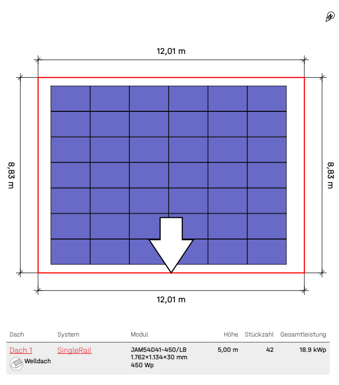
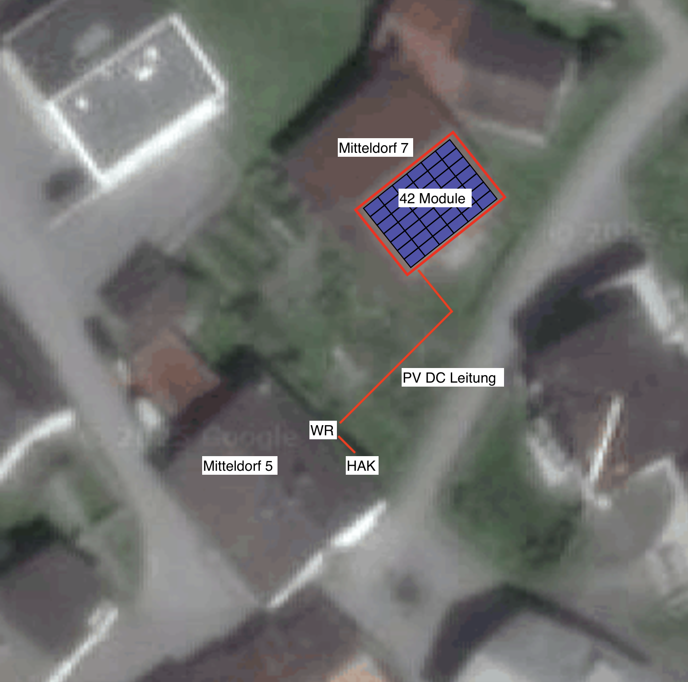
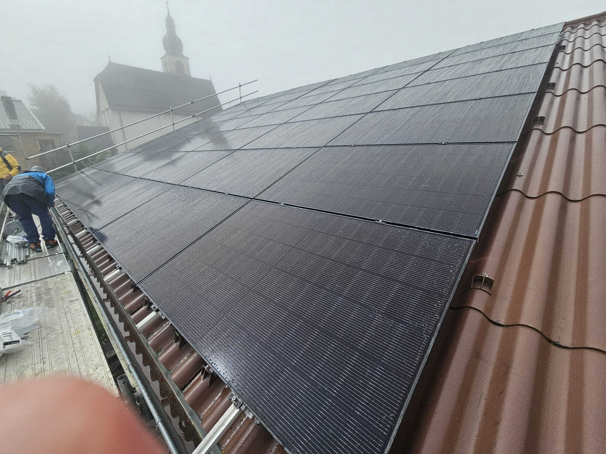

## Übersicht

Mein achtes PV-Projekt (nach der NIV14 Bewilligung - total wäre es da 20.) hat mich auf den Heinzenberg im Kanton Graubünden geführt. In der kleinen Gemeinde Urmein durfte ich zusammen mit einem Bauer eine 18.9 kWp Anlage auf seinem Stallgebäude realisieren. Das Besondere an diesem Projekt: Das Wohnhaus daneben mit dem B&B hat u.a. wegen diversen Gefriertruhen eine Grundlast von etwas über 1 kW - perfekte Voraussetzungen für einen hohen Eigenverbrauchsanteil.

## Wie es dazu kam

Schon 1971 hat mein Grossvater auf dem Heinzenberg ein Ferienhaus erstellt. Entsprechend habe ich und meine Geschwister natürlich auf dem Heinzenberg Skifahren gelernt. 2014 durften wir vier Geschwister das Ferienhaus von unserem Grossvater übernehmen. Heute hat es natürlich auch eine PV Anlage drauf (google nach Haus Caprau - das sind fast 25 kWp!).

Da auch meine Kinder auf dem Heinzenberg Skifahren gelernt haben und fast alle Heinzenberger Bauern Skilehrer sind, kam ich ins Gespräch mit dem Bauer. Er hatte schon länger mit dem Gedanken gespielt, auf seinem Stalldach eine PV-Anlage zu installieren. Das Süddach mit 25° Neigung bot ideale Voraussetzungen. Die bisherigen Angebote waren aber allesamt zu wenig interessant.

Was den Bauer interessierte: Er wollte nicht einfach eine Anlage bauen lassen und dafür CHF 40'000+ hinblättern. Als ich ihm mein Contracting-Modell vorstellte, war er begeistert. Bei diesem Modell gehört die Anlage der anbeda AG, bis sie abbezahlt ist. Der Eigentümer zahlt den Strom zu einem vergünstigten Tarif und nach der Amortisation geht die Anlage in seinen Besitz über. So kann er von Anfang an profitieren, ohne eine grosse Investition tätigen zu müssen.

## Die Anlage

Nach der Planung und Bewilligung durch EWZ (ja, das Elektrizitätswerk der Stadt Zürich ist hier oben im Bündnerland der Netzbetreiber!) haben wir folgende Anlage konzipiert:

| Komponente | Details |
|------------|---------|
| **Module** | 42× JA Solar JAM54D41-450/LB |
| **Leistung** | 18.9 kWp DC / 17 kVA AC |
| **Wechselrichter** | Huawei SUN2000-17KTL-M5 |
| **Strings** | 2 × 21 Module (S1.1 und S1.2) |
| **Ausrichtung** | Süd, 25° Neigung |
| **Erwarteter Ertrag** | ~19'960 kWh/Jahr |

Die JA Solar Module mit 450W hatten die idealen Dimensionen für das Dach und eines der besten Preis-Leistungs-Verhältnisse am Markt. Mit dem Huawei Wechselrichter habe ich bereits bei mehreren Projekten gute Erfahrungen gemacht.

## Montage

Die Montage der Panels hat der Bauer mit Kollegen (u.a. ein ehemaliger Dachdecker!) zwischen dem 11. September und 2. Oktober 2025 durchgeführt. Da es für Laien nicht erlaubt ist, die Verkabelung zum Wechselrichter zu machen, habe ich als Bewilligungsträger nach NIV Art. 14, nachdem die Unterkonstruktion fertig war, alles verkabelt. Zum Glück ist das Wetter im Bündner Herbst oft gnädig - an den meisten Tagen herrschte Sonnenschein, fast mit Ausnahme auf dem folgenden Bild:

Eine besondere Herausforderung war die Kabellänge: Der Wechselrichter wurde an der Ostfassade eines Wohnhauses auf der Nachbarsparzelle montiert. Die DC-Kabel verlaufen entsprechend vom Stalldach zum Wechselrichterstandort.

Am 2. Oktober 2025 konnte ich die Anlage dann erfolgreich in Betrieb nehmen.



## Messprotokoll

Bei der Inbetriebnahme haben wir mit dem Benning PV1-1+ folgende Werte gemessen (bei 800 W/m² Einstrahlung):

| String | Leerlaufspannung | Kurzschlussstrom | Isolationswiderstand |
|--------|------------------|------------------|---------------------|
| S1.1 | 791 V | 12.16 A | 67 MΩ |
| S1.2 | 795 V | 12.22 A | 74 MΩ |

Die Werte sind sehr gut und zeigen, dass beide Strings sauber arbeiten.

## Eigenverbrauch

Was mich bei diesem Projekt besonders freut: Die hohe Grundlast durch die Gefriertruhen bedeutet, dass rund um die Uhr Strom verbraucht wird - ideal für eine hohe Eigenverbrauchsquote.

### Erste Zahlen aus Q4 2025

Bei der Planung sind wir von 2'500 - 3'100 kWh Produktion im Q4 ausgegangen. Tatsächlich produziert hat die Anlage **3'540 kWh** - besser als erwartet!

Der Verbrauch im selben Zeitraum lag bei 3'275 kWh, davon wurden 1'108 kWh direkt von der PV-Anlage gedeckt. Das entspricht einer **Eigenverbrauchsquote von 33.8%**.

Noch eindrücklicher ist der Vergleich des Netzbezugs:
- **Mai - September** (vor PV): 40.3 kWh/Tag
- **Oktober - Dezember** (mit PV): 25.3 kWh/Tag
- **Reduktion: 37% weniger Netzbezug**

Die Gefriertruhen brauchen im Winter vermutlich etwas weniger Strom, was die "nur" 33.8% Eigenverbrauch erklärt. Im Sommer erwarte ich deutlich höhere Werte - mehr PV-Ertrag trifft auf höheren Kühlbedarf.

## Learnings

- **Kabellängen planen**: Bei diesem Projekt mussten wir lange DC-Strecken überbrücken. Das funktioniert gut, muss aber bei der Planung berücksichtigt werden (Kabelquerschnitt, Verluste).
- **Netzbetreiber abklären**: Ich war überrascht, dass EWZ hier oben der Netzbetreiber ist. Die Bearbeitung war aber unkompliziert.
- **Contracting erklärt sich nicht von selbst**: Viele kennen das Modell nicht. Es lohnt sich, Zeit zu investieren, um die Vorteile zu erklären.

## Fazit

Das achte Projekt ist erfolgreich abgeschlossen! Die Anlage auf dem Heinzenberg produziert fleissig Strom und der hohe Eigenverbrauch macht das Ganze wirtschaftlich besonders attraktiv.

Für den Bauern bedeutet das: Er zahlt weniger für seinen Strom als vorher, musste keine grosse Investition stemmen und bekommt am Ende eine abbezahlte PV-Anlage. Und ich durfte wieder ein spannendes Projekt in einer wunderschönen Gegend realisieren. Win-Win!

Falls ihr Fragen zum Projekt oder zum Contracting-Modell habt, meldet euch gerne.
