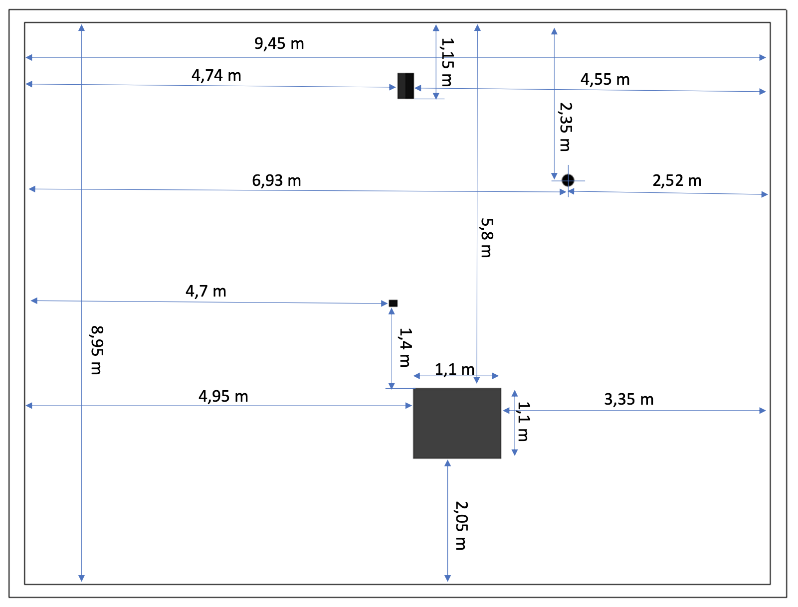
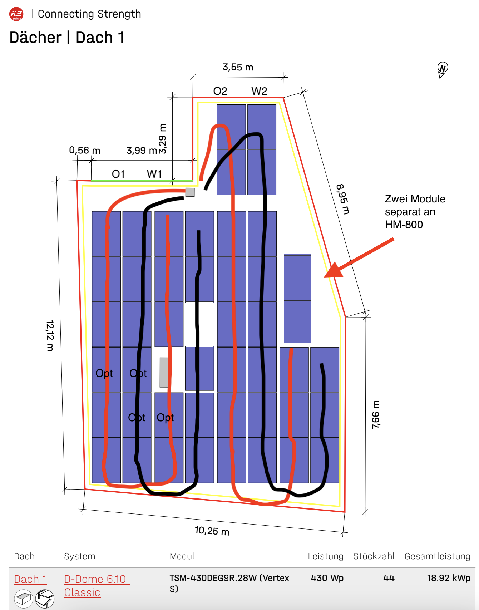
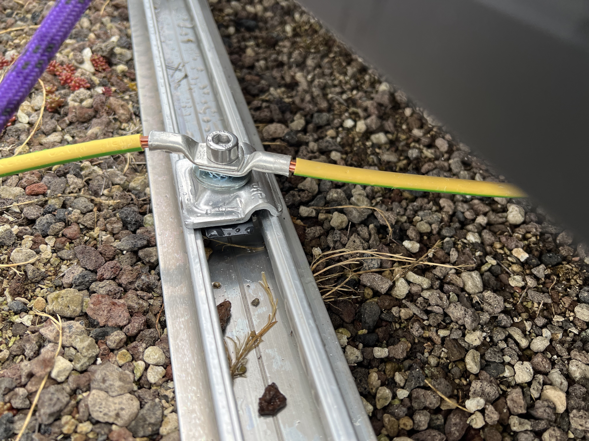
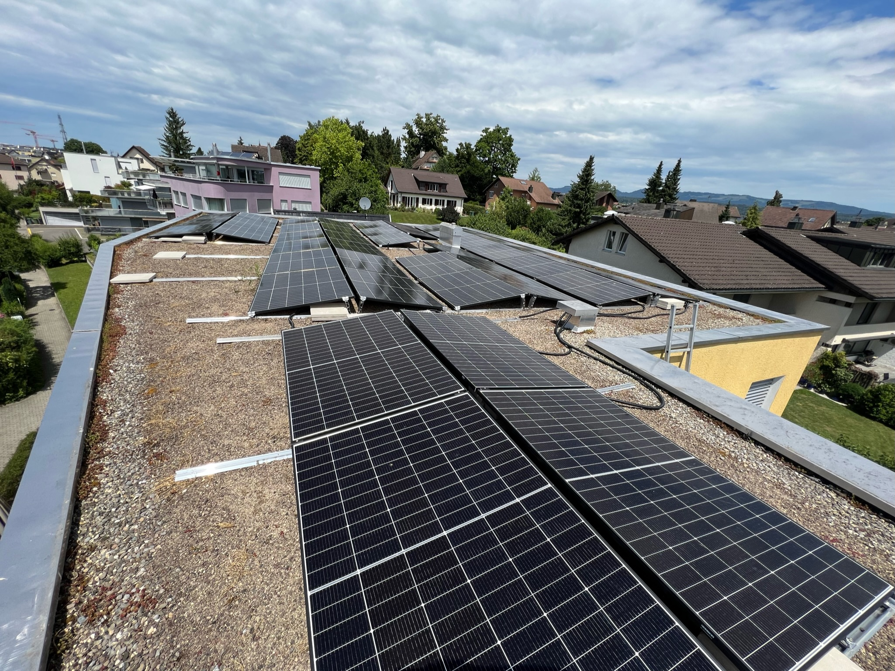

## Einführung

Seit ich angefangen habe, über meine Selbstbauerfahrungen zu berichten, werde ich immer wieder um Hilfe gebeten. Nicht nur beim offensichtlichsten, bei der Materialbestellung, sondern auch rundherum. Dieser Beitrag soll möglichst viele Fragen bereits abdecken! Ich freue mich über euer Feedback und über Ergänzungen. Gerne über die Kanäle auf der Hauptseite oder gleich als PR auf GitHub via Link oben 'Änderungen vorschlagen'.

Wichtig zu wissen: Ich fokussiere mich immer auf Flachdächer. Viele Erfahrungen sind auch auf Schrägdächer anwendbar. Sobald alle Flachdächer in der Schweiz zugebaut sind, überlege ich mir, meinen Fokus zu erweitern :-) Alle rechtlichen Aspekte beziehen sich auf die Schweiz.

## Schritt 1: Ausmessen

Um eine PV Anlage zu planen, musst du genau wissen wie gross dein Dach ist und wo allfällige Hindernisse sind. Nicht alle Hindernisse verhindern schlussendlich die Platzierung von Panels! Z.B. die Entlüfung der Abwasserleitung kann auch etwas gekürzt werden. Also notiere dir auch, wie hoch die jeweiligen Hindernisse sind. Um dir den Abmessungen von allfälligen Plänen sicher zu sein, ist es unumgänglich, auf dem Dach selber zu messen. Am besten machst du auch gleich viele Fotos.

Ein super Beispiel von einem guten Plan ist der folgende. Da fehlen nur noch die Höhenangaben der Hindernisse.

## Schritt 2: Planen mit K2 Base von K2-Systems

Ich verwende für die Unterkonstruktion immer D-Dome von K2-Systems für eine Ost-West Ausrichtung. Ich finde das System super einfach zum montieren und durchdacht! Toll ist auch, dass man das Dach mit K2 Base planen kann und das Tool schlussendlich eine Artikelliste ausspukt!

Warum Ost-West und nicht Süd? Ganz einfach: Ost-West bringt weniger Ertrag pro Tag, jedoch ist es besser über den Tag verteilt. Mit einer Ost-West Anlage hat man in den meisten Fällen einen höheren Eigenverbrauch und dadurch ist die Anlage wirtschaftlicher.

Damit ihr einen funktionierenden Account einrichten könnt für K2 Base, müsst ihr euch als Firma registrieren.

Meine Empfehlungen zur generierten Artikelliste: Porter (zwei L-Profile unter den Panels) sorgen für Stabilität der Unterkonstruktion, sehen optisch besser aus wie wenn man die Steine auf Speed Porter stellt und man kann die Unterkonstruktion perfekt ausrichten bevor die Module kommen. Ausser man legt die Schienen auf Bitumen finde ich die MAT S Matten sowie auch das MAT S Tool überflüssig.

Als Module könnt ihr von Trina Solar Energy das TSM-435NEG9R.29 (Vertex S+) wählen. Das ist 1762x1134mm. Wenn es von der Länge her knapp wird, kann man z.B. auf Longi Solar LR5-54HTH-425M Explorer gehen, die sind wie viele andere nur 1722x1134mm, also 4cm kürzer.

Am Schluss könnt ihr ein schönes PDF erstellen lassen mit allen Infos inkl. Belastungsplan.

Falls an einem Ort ein Hindernis im Weg ist, löscht K2 immer zwei Module weg. In der Praxis ist es auch möglich, nur ein einzelnes Modul wegzulassen. Dafür benötigt man die gleichen Teile der Unterkonstruktion mit Ausnahme der Klemmen. Da brauchts dann statt 4x MC (Mittelklemme) einfach 4x EC (Endklemme). Ich bestelle mir da jeweils noch einen Windbreaker Short von S-Dome, damit die offene D-Dome Hälfte vor Wind geschützt bleibt. Die ganze Statikberechnung von K2 ist dadurch natürlich ungültig und ihr sollt wissen was ihr tut!

Mit der Anzahl Module mal die Leistung (aktuell im Oktober 2023 sind 440W die am meisten erhältlichen Panels) bekommt ihr die DC-Leistung, z.B. 20x 440 Wp = 8.8 kWp.



## Schritt 3: Bewilligung/Bauanzeige Gemeinde

Die meisten Gemeinden bieten Onlineformulare an, welche es erlauben, Photovoltaikanlagen (angebaut) im vereinfachten Verfahren anzumelden. Ihr habt nun alle Infos und könnt - falls nötig - auch einen Dachplan aus dem von K2 Base erstellten PDF screen-shotten. Ob ein Panel mehr oder weniger spielt meines Erachtens zu diesem Zeitpunkt keine Rolle.

## Schritt 4: Layout finalisieren und Wechselrichter wählen

Zu diesem Zeitpunkt stellt sich auch die Frage ob ihr eine Batterie wollt oder nicht. Dazu werde ich zu einem gegebenen Zeitpunkt einen separaten Beitrag schreiben, denn Batterien lohnen sich im Vergleich zu Photovoltaikanlagen nicht automatisch. Wichtig auch zu wissen: Eine Batterie heisst noch nicht, dass ihr auch Strom habt wenn der Netzbetreiber einen Stromausfall hat! Dazu benötigt man noch zusätzlich einen Netztrenner sowie einen kaltstartfähigen Wechselrichter.

Da Hybridwechselrichter, bei welchen man DC-seitig eine Batterie anhängen kann, nicht viel oder teilweise gar nicht teurer sind wie normale Wechselrichter, bietet sich ein solcher auch an, wenn man vielleicht später mal eine Batterie nachrüsten möchte. Selbstverständlich gibt es auch AC-gekoppelte Batterien aber die sind weniger effizient, da die Energie mehrfach transformiert werden muss: PV(DC)->WR(AC)->Batt(DC)->Hausnetz(AC).

Bei der Verstringung werden jeweils Module gleicher Ausrichtung (Ost/West) zusammengehängt. Es kann sein, dass man das Layout noch minim anpassen oder ein Modul weglassen muss wenn es vom Design nicht auf den Wechselrichter passt. Bis zwei Strings mit je maximal 17 Modulen ist das kein Problem bei einem Wechselrichter mit zwei MPP Trackern. Bei mehr als 17 Modulen pro String kommt man mit den meisten Modulen über eine Systemspannung von 1000V, was in der Schweiz nicht erlaubt ist. Deshalb muss man bei grösseren Anlagen zwei Strings parallel schalten. Dafür müssen beide Strings die selbe Anzahl Module haben.

Um die Komplexität zu meistern, bieten die meisten Wechselrichterhersteller Tools an, welche einem aufzeigen, welches Modell zu welchen Strings passt. Gute Erfahrungen habe ich mit Fronius und Huawei gemacht - Solar Edge habe ich immerhin mal gesehen. 

Auch eine Möglichkeit ist, eine Demo/Test-Version vom Planungstool PVSol zu verwenden - leider gibt es keine Version für Mac/Linux Benutzer und ich bin seit über 24 Jahren Windows-frei!

Bei starker Verschattung solltest du die entsprechenden Module (gleichviel pro parallelem String) mit Optimizern ausstatten. Fronius verwendet mit dem Dynamic Peak Manager ein eigenes System ohne Einsatz von zusätzlicher Hardware.

Gerne schaue ich mir eure Stringpläne und Wechselrichterwahl an! Am besten taggst du mich auf Bluesky, LinkedIn oder X!

## Schritt 5: TAG - Technisches Anschlussgesuch

Wenn der Wechselrichter ausgewählt ist sowie Modulleistung und Anzahl, dann ist die AC kVA Leistung des Wechselrichters im Datenblatt ersichtlich und die DC Leistung kann man berechnen. Diese Informationen braucht es um beim lokalen Elektrizitätsversorger (EVU), ein technisches Anschlussgesuch (TAG) zu stellen. Wenn das bewilligt wird, bedeutet dies, dass das EVU ausreichende Kapazität im örtlichen Netz zur Verfügung hat und einem Baustart aus technischer Sicht nichts im Weg steht.

## Schritt 6: Warten und Subventionsanträge

Nun gilt es auf die Bewilligung der Gmeinde und diejenige vom EVU für das TAG zu warten. Sollte deine Gemeinde oder der Kanton neben den Subventionen vom Bund (müssen bei kleineren Anlagen nicht im Voraus beantragt werden) ebenfalls Subventionen bezahlt werden (im Kanton Zug ist das z.B. der Fall!), dann muss dies mindestens in Zug vor Baubegin beantragt werden.

## Schritt 7: Vorbereitungen Dach - Spengler

Solltest du kein vorbereitetes Rohr vom Dach in den Keller haben, muss das z.B. von einem Spengler gemacht werden und du kannst den Spengler deines Vertrauens aufbieten. Selbstverständlich kann man das natürlich auch im DIY machen, bei Löcher ins Dach bohren und abdichten hört es bei mir aber auf! Richtpreis für so ein Rohr direkt aufs Dach, inkl. Kernbohrung ist CHF 2'000.-.

Was ihr nicht wollt auf dem Dach sind Pflanzen. Interessanterweise wachsen die stärker unter PV Modulen wie ohne Module! Also ist hier meine Empfehlung, den Unkräutern mit einem Vlies den Gar auszumachen! Als Profi-Vlies könnte z.B. [dieses](https://www.hortima.ch/shop/artikel/art/5763/) dienen.

## Schritt 8: Material bestellen

Da nun alles auf grün steht, kann das Material bestellt werden! Ein erster grosser Moment, meistens nur durch einen Klick mit der Maus. 

Benötigst du Hilfe bei der Materialbestellung- und Auswahl? Gerne unterstütze ich euch mit meinen B2B Accounts (bekommt man wegen der grossen Nachfrage nur noch mit einer Solarfirma!) gegen eine kleine Kommission von 3%. In der Regel muss das Material von mehreren Händlern - je nach Verfügbarkeit, Preis und Sortiment - bestellt werden. Die Konditionen bei einer Bestellung über anbeda AG: 30% Anzahlung, Rest nach Lieferbestätigung - vor Ankunft der Lieferung.

Hast du schon Kollegen organisiert für den Bau? Jetzt wäre der Moment, denn nach der Bestellung weisst du, wann das Material ankommen wird! Sei dir bewusst, dass du als Hauseigentümer verantwortlich bist, was auf deinem Dach passiert. Organisiere z.B. Absturzsicherungen! Meistens sind entsprechende Vorrichtungen bereits vorhanden auf dem Dach (und führen zu mindestens einem Modul weniger :( )

Danke an X User [Michi_k](https://x.com/mick__k/status/1713410565723320643) für folgenden Link: [Arbeiten auf Dächern – so bleiben Sie sicher oben (Absturzsicherung)](https://www.suva.ch/de-ch/download/dokument/arbeiten-auf-daechern--so-bleiben-sie-sicher-oben/arbeiten-auf-daechern--so-bleiben-sie-sicher-oben--44066.D)

## Schritt 9: Bau - Wechselrichter, Kabelkanäle, Unterkonstruktion

Sobald das Material vorhanden ist, würde ich je nach Wetter mit der Montage des Wechselrichters und Kabelkanälen (üblicherweise 60x40mm - AC und DC nie im gleichen Kanal, nur kreuzen erlaubt) im Keller starten oder mit dem Einziehen der Solarkabel und dem Erdungskabel vom Dach in den Keller (Achtung: Kabel anschreiben!). 

Beauftrage nach der Montage vom Wechselrichter einen Elektriker, der dir den Wechselrichter anschliessen kann. Wenn der Elektriker den DC Teil auch machen kann (meine Empfehlung, falls er will/kann), macht er besser später alles auf ein Mal.

Bei schönem Wetter folgt dann die Unterkonstruktion auf dem Dach. Wenn du die Porter (L-Profile) und die Speed Spacer gekauft hast, ist es relativ einfach möglich, die Konstruktion sehr genau auszurichten. Bei einer Modulbreite von 1134mm ist der Abstand vom Peak und SD genau 1m. Bei nur schon 5-6 Modulen in einer Reihe kann ein kleiner Fehler von wenigen Millimetern zu Centimetern anwachsen und eine saubere Modulmontage verhindern. Nimm es besser von Anfang an sehr genau!

Zur Unterkonstruktion gehört auch das Erdungskabel. Wir verwenden ein 16mm2 T-Seil, welches alle Schienen verbindet und im Keller auf der Erdungsschiene endet. Im Bild ist eine Blitzschutzklemme (als Option im K2 Base anwählen) von K2 Systems - eigentlich für ein Alu Draht gedacht, funktioniert aber tip top auch für Kabelendschuhe! Mit den Unterlagsscheiben halte ich Kupfer und Alu möglichst auseinander.

## Schritt 10: Bau - Belastung Unterkonstruktion

Bringe die Steine für die Belastung der Unterkonstruktion aufs Dach und positioniere sie gemäss Plan von K2. Tipp: Wenn die Steine schon früher auf dem Dach sind, sind sie meistens im Weg.

## Schritt 11: Bau - Rückschlaufen legen

Vom Keller gibts pro String zwei Kabel - normalerweise rot für plus und schwarz für minus. Beim Oststring verbinde ich das schwarze Modul mit dem weiblichen Stecker vom ersten Modul. D.h. am schwarzen minus Kabel wird ein männlicher Stecker montiert und im Keller entsprechend ein weiblicher Stecker, wie sich das für minus gehört. Das rote Kabel folgt dem ganzen String als sogenannte Rückschlaufe - damit sich weniger Felder bilden, welche z.B. Blitze anziehen können. Das rote Kabel endet am Ende vom String mit einem weiblichen Stecker.

Beim Weststring entsprechend umgekehrt mit schwarz als Rückschlaufe und bei allfälligen weiteren Strings entsprechend der Ausrichtung.

Unter den Modulen ist das Kabel gut vor UV Strahlen und Alterung geschützt. Führt ein String in eine andere Modulreihe, muss man das Kabel zwischen den Reihen vor Sonnenlicht schützen. Sehr gut eignen sich hierfür Alurohre, welche man bereits jetzt in die Rückschlaufe einfädeln muss. Die Verbindung von Modul zu Modul in eine andere Reihe erfordert jeweils ein Verlängerungskabel, welches man idealerweise auch direkt in das Alurohr einfädelt. Diese Alurohre bitte mit der Unterkonstruktion verbinden, damit alle Metallteile geerdet sind.

## Schritt 12: Bau - Panels

Wenn alles gut vorbereitet ist, geht der letzte Schritt auf dem Dach schnell! Falls ihr Optimizer einsetzt, solltet ihr euch aufschreiben, welche Seriennummer wo verbaut wurde. Das ermöglicht später in den Tools und Apps der Wechselrichterhersteller das Layout korrekt nachzubauen.

Wichtig bei der Installation der Panels: Keine Stecker auf den Boden! Sämtliche Stecker sollen mit Kabelbindern so befestigt werden, damit sie in der Luft sind. Sie sind zwar gegen Wasser geschützt aber sicher ist sicher. 

## Schritt 13: Inbetriebnahme mit NIV14

Stecker crimpen und den Wechselrichter in Betrieb nehmen darf nur jemand mit Betriebsbewilligung nach NIV 14. Ich als Elektroingenieur ETH darf das nicht, gemäss ESTI gelte ich als Laie, was ich ein völliger Witz finde. Ich müsste 18 Tage Ausbildung machen und eine Prüfung ablegen!?

Aber hey! Nach dem Knopfdruck beim bestellen überlässt euch vielleicht der Elektriker oder Solarbauer das Einschalten der Anlage! DC on, Sicherung rein und los gehts!

## Schritt 14: Unabhängige Schlusskontrolle & beantragen Subventionen Pronovo

Wenn der AC und DC Teil fertig sind, erstellt euch der Elektriker und je nach Fähigkeiten vom Elektriker noch der Solarbauer einen Sicherheitsnachweis (SiNa) aus. Dieser wird dann von einer unabhängigen Kontrollinstanz vor Ort überprüft und zusätzlich werden mit einer Drohne noch Fotos vom Dach gemacht, damit die Behörden die Module nachzählen können bevor sie die Subventionen ausbezahlen.

Im Fall der Schweiz ist das die Pronovo, bei welcher Ihr nun den Antrag für die Subventionen stellen könnt via Online Formular. Per Oktober 2023 lohnt sich das, denn es werden 350.-/kWp ausbezahlt! Die Bemessungsgrundlage ist glücklierweise die Leistung und nicht etwa der Kaufpreis, denn damit hätte man im DIY Fall Nachteile!

## Schritt 15: Monitoring

Darüber könnte ich nun auch wieder einen Roman schreiben. Wie überall gibt es hier verschiedene Varianten: Die App des Herstellers des Wechselrichters, ein kommerzielles Tool, welches mit mehreren Devices sprechen kann wie der Solarmanager - gegründet von zwei Studienkollegen von mir! - oder die DIY Variante, welche ich gewählt habe: Raspberry PI, Prometheus und Grafana. Vieles davon findet ihr in meinem [GitHub Repo](https://github.com/thomhug/pv).

Alles klar? Wahrscheinlich noch nicht? Schreibt mir eure Fragen auf Social Media, ich versuche sie zu beantworten und versuche den Beitrag laufend zu verbessern!

[Beitrag auf Bluesky](https://bsky.app/profile/tomdawon.bsky.social/post/3kbqnhnqqqj2t)
[Beitrag auf LinkedIn](https://www.linkedin.com/feed/update/urn:li:activity:7119091706439811072/)



